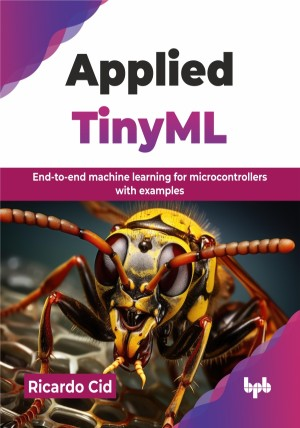

# Applied TinyML

End-to-end machine learning for microcontrollers with examples.

This is the repository for [Applied TinyML
](https://bpbonline.com/products/applied-tinyml?variant=44654944878792),published by BPB Publications.

## About the Book
AI is useful when it runs in large machines in data centers, but only when it makes it down to stand-alone edge devices will it unlock countless new use cases and applications. TinyML is transforming AI by bringing ML capabilities to small, low-power devices at the very edge of the network.

This book will guide you through building these smart devices. It establishes TinyML's core foundations and a methodology for application development, from problem definition to power management and cost analysis.  You will explore practical skills applications, learning sound, movement, and image classification, followed by advanced techniques like object tracking and sensor fusion, using methods such as Kalman filters. You will explore deep learning regression for predictive tasks and essential anomaly detection for identifying unusual patterns, all demonstrated through real-world use cases.

After reading this book, you will be fully equipped to design, build, and deploy complete TinyML systems, from data collection and feature extraction to model training, deployment, and hardware integration. You will gain hands-on skills and the practical engineering knowledge needed to bring intelligent low-power devices to life.

## What You Will Learn
• Build smart gadgets that recognize sounds and movements.

• Learn skills beyond coding to create TinyML systems.

• Design, build, and deploy TinyML applications.

• Design smart systems that can learn on their own.

• Make devices that understand and classify images.

• See how AI and ML fit into the real-world.
